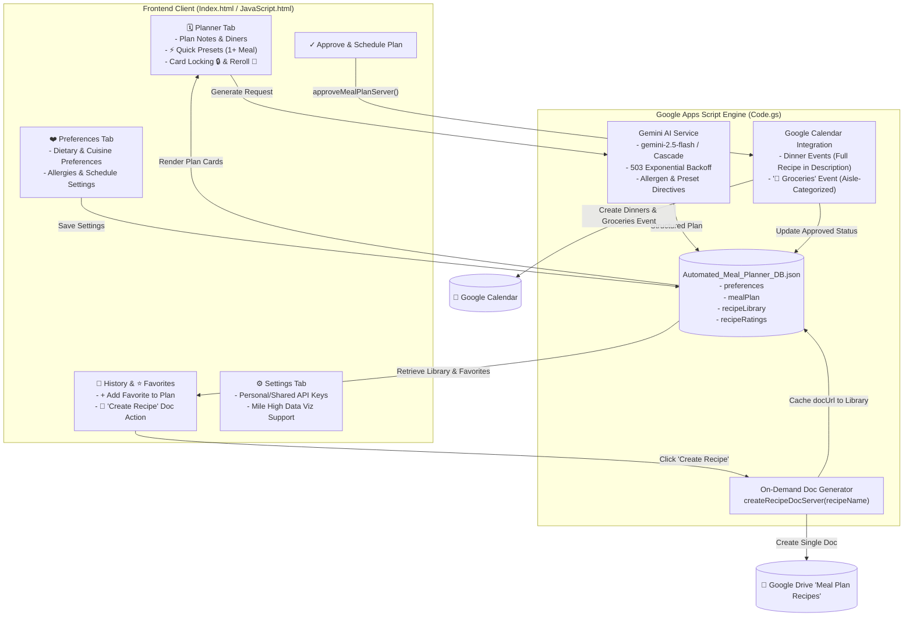

# Executive Summary: Meal Planning Application

**Date:** September 20, 2026  
**Status:** ✅ Production-Ready | All 18 Test Suites (25 Automated Tests) Passing  
**Key Docs:** [Product Review](file:///c:/Users/philp/Documents/Meal%20Planning/docs/PRODUCT_REVIEW.md) | [Calendar-First Architecture Spec](file:///c:/Users/philp/Documents/Meal%20Planning/spec/calendar_first_architecture_and_ui_streamlining_spec.md) | [Prompt Evaluation Protocol](file:///c:/Users/philp/Documents/Meal%20Planning/docs/PROMPT_EVALUATION_PROTOCOL.md) | [README.md](file:///c:/Users/philp/Documents/Meal%20Planning/README.md) | [Backlog CSV](file:///c:/Users/philp/Documents/Meal%20Planning/jira_backlog_meal_planner_improvements.csv)

---

## 1. Summary of Delivered Epics & Milestone Commit History

The application has completed multiple high-impact development milestones, transitioning from an expansive multi-tool prototype into a **streamlined, Calendar-First production application** that eliminates UI friction and centers weekly meal execution directly in Google Calendar:

| Commit | Scope / Milestone | Description |
| :--- | :--- | :--- |
| `3b60ebc` | **API Key Management** | Hybrid Personal / Shared Google Gemini API key management UI with secure storage in Apps Script `ScriptProperties` / `UserProperties`. |
| `ed1caa1` | **Test Infrastructure** | Established baseline Node.js headless testing harness. |
| `a094fb4` | **MPA-17 (Mobile UX)** | Mobile-first responsive redesign: sticky thumb navigation bar (`<768px`), compact cards, 44px touch targets, iOS safe-area insets. |
| `2108c24` | **Bug Fix** | Resolved notification toast queueing and message dismissal bug. |
| `9b99bf7` / `5ad16d4` / `d201f81` | **Brand & Visuals** | Dynamic SVG/canvas favicon, dismissible welcome banner, typography refinements, matte styling. |
| `29708b2` | **MPA-8 (Rating & Reuse)** | Integrated recipe bookmarking, persistent recipe library in Drive DB, and intelligent plan generation reusing family favorites. |
| `4710b83` | **Test Suite Consolidation** | Consolidated fast unified test runner (`npm test`) executing in <1s across DOM, CSS, backend logic, and schema migrations. |
| `b09bf6b` | **MPA-15 (Favorites Reconciliation)** | 1-click favorite insertion from History into the active meal plan grid with live ingredient and diner re-aggregation. |
| `f352485` | **MPA-13 (In-App Grocery List)** | Built interactive grocery checklist modal with 7 aisle categories, strike-through state, and 1-click clipboard export. |
| `70ed572` | **MPA-10 & MPA-11 (Swaps & Chips)** | Single-recipe rerolling via Gemini (`rerollSingleRecipeServer`), card locking (`🔒 Lock`), and one-tap quick preset chips (`⚡ Under 30 Mins`, `🥘 One-Pot`, `👶 Kid-Friendly`, etc.). |
| `00e87bd` | **MPA-12 (Fridge Clean Out)** | On-hand ingredients priority injection in backend prompt engine to minimize household food waste. |
| `5d73af6` | **Code Polish** | Standardized method and variable naming conventions across frontend and Apps Script backend. |
| `768cbda` | **MPA-20 (Prompt Evaluation Suite)** | Built headless Tier 1 deterministic prompt evaluation harness (`test/prompt-eval/runner.js`, allergen dictionary, scenario validation). |
| `7b31d87` | **Offline Grocery Exploration** | Implemented prototype grocery shopping mode with LocalStorage caching and Wake Lock API. |
| `a1f3d50` | **Complexity Assessment** | Conducted comprehensive scope and UI audit identifying cognitive friction points and outlining the simplification blueprint. |
| `c8e27df` | **Calendar-First Architecture & UI Streamlining** | Major architectural streamlining: switched to Calendar-First execution (dinners + sectioned Groceries event), deprecated bulk Docs generation, added on-demand recipe doc creation, merged cuisine matrix into dietary preferences, and removed PWA/offline modal bloat. |
| `4a7a77b` | **Syntax & Test Pruning** | Resolved HTML markup syntax and pruned test assertions to align with the streamlined DOM structure. |
| `5eaa60a` | **Preferences Guidance Enhancement** | Added descriptive helper guidance under the Preferences panel for natural-language dietary and cuisine inputs. |
| `43c82d5` | **Mobile UX Fix** | Managed inactive notification toast opacity and visibility to prevent overlaying the mobile sticky bottom navigation bar. |
| `6dc1a38` | **DB Bug Fix & Backfill Resiliency** | Fixed recipe history & library retrieval bugs, ensuring auto-ingest and schema backfilling for legacy arrays and unindexed plan recipes. |
| `35b51d9` | **Gemini 503 Exponential Backoff & Retry** | Added automatic exponential backoff retry for transient 503 service unavailable errors and seamless fallback to `gemini-2.5-flash`. |
| `3882890` | **Model Cascade & 404 Optimization** | Upgraded model endpoint cascade, instantly bypassing deprecated or 404 model endpoints. |
| `c9ce280` / `a110583` / `4c02f94` | **MHDV Branding & Settings Polish** | Added Mile High Data Viz author branding, support links, clear OAuth scope disclosures, and deployment guide in Settings. |
| `69b8db2` | **Executive Product Review & Alignment** | Completed formal executive product review (4.8/5 score, Conditional Go verdict), aligning all UI microcopy and release gates. |
| `f8d524d` | **Documentation & README Overhaul** | Rewrote root `README.md` to cleanly document the Calendar-First architecture, on-demand docs, database schema, and deployment commands. |

---

## 2. Current State of the Application

* **Stability & Automated Test Suite:** The repository is 100% green with **18 automated test suites (25 tests)** executing in `<1s` via `npm test`. The suite validates DOM template integrity, responsive CSS tokens, backend API resolution, schema migration, card locks, prompt safety, and calendar-first payload generation.
* **Continuous Deployment (`npm run ship`):** A custom automated release pipeline (`ship.js`) syncs git commits to GitHub, pushes Apps Script files via clasp (`npx clasp push`), and creates immutable versioned deployments (`npx clasp deploy`).
* **Core Application Capabilities:**
  1. **Calendar-First Weekly Scheduling:** Approving a meal plan schedules all dinner events on Google Calendar with full recipe descriptions, diner-scaled ingredients, and step-by-step cooking instructions embedded directly in the event description. Additionally, a dedicated morning **"🛒 Groceries"** calendar event is created with the entire consolidated shopping list organized by store aisle.
  2. **On-Demand "Create Recipe" Doc Generation:** Rather than cluttering Google Drive with throwaway documents on every plan approval, users can generate a formatted Google Doc on-demand for specific dishes from the **History** and **Favorites** views (`📄 Create Recipe` / `📄 Open Doc`).
  3. **Intelligent AI Generation Engine:** Generates weekly dinner plans via Google Gemini with active dietary preferences, diner counts, and non-universal quick preset directives (`⚡ Under 30 Mins`, `🥘 One-Pot`, `👶 Kid-Friendly`, `🥗 Low Carb`, `🥬 Plant-Forward`, `🍲 Comfort Food`). Built-in retry with exponential backoff handles 503s gracefully.
  4. **Plan Customization & Reroll:** Allows swapping/rerolling individual disliked recipes (`🔄`), locking preferred recipes (`🔒`), and 1-click insertion of starred family favorites from history.
  5. **Natural-Language Preferences:** Consolidated freeform input for dietary guidelines, preferred cuisines (e.g., Italian, Mexican, Mediterranean, Asian-inspired), and lifestyle dislikes without rigid button matrices.
  6. **Persistent Recipe Library & Resilient DB:** Structured storage in `Automated_Meal_Planner_DB.json` with schema migrations, star ratings, and resilient history retrieval sourced directly from the database.
  7. **Hybrid API Key Management:** Zero-friction onboarding with a shared starter key stored in `ScriptProperties`, while allowing personal Google AI Studio key overrides saved securely in `UserProperties`.

---

## 3. Architecture & Data Flow

### Code Footprint Summary

| File | Approximate Lines | Primary Responsibilities |
| :--- | :--- | :--- |
| **[Code.gs](file:///c:/Users/philp/Documents/Meal%20Planning/Code.gs)** | ~1,604 | Calendar-First scheduling, on-demand doc creation, Drive JSON DB, Gemini AI prompt engine with 503 backoff, recipe reuse. |
| **[Index.html](file:///c:/Users/philp/Documents/Meal%20Planning/Index.html)** | ~396 | Streamlined HTML template, 4 tab panels, quick preset chips, recipe cards, history & favorites views, MHDV branding. |
| **[JavaScript.html](file:///c:/Users/philp/Documents/Meal%20Planning/JavaScript.html)** | ~2,363 | Tab routing, client state management, card locking/rerolling, on-demand doc handler, toast notifications. |
| **[Styles.html](file:///c:/Users/philp/Documents/Meal%20Planning/Styles.html)** | ~2,534 | Responsive layout tokens, matte dark theme, mobile bottom navigation bar, touch targets. |
| **[test/test-suite.js](file:///c:/Users/philp/Documents/Meal%20Planning/test/test-suite.js)** | ~1,368 | 18 unified test suites covering DOM, CSS, backend logic, schema migrations, prompt safety, and calendar formatting. |

---

## 4. AI Prompt Engineering & Safety Evaluation

A formal evaluation framework ([docs/PROMPT_EVALUATION_PROTOCOL.md](file:///c:/Users/philp/Documents/Meal%20Planning/docs/PROMPT_EVALUATION_PROTOCOL.md)) validates prompt construction and constraint adherence:

### Multi-Tier Evaluation Framework
1. **Tier 1 (Deterministic Safety & Schema Rules):** Headless automated validation (`test/prompt-eval/runner.js`) executing regex-based allergen detection, JSON schema structure compliance, avoided cuisine checks, and quick prep time bounds ($\le 30$ mins for `quick` tags).
2. **Tier 2 (Semantic Evaluation):** LLM-as-a-judge scoring culinary realism, portion scaling accuracy, and ingredient synergy on a 1–5 rubric.
3. **Tier 3 (Human In-the-Loop):** Periodic spot-checks for seasonal appropriateness and preparation complexity.

### Production Prompt Engineering Safeguards
* **Native System Instructions:** Invariant persona definitions and safety constraints are isolated in Gemini's `systemInstruction` payload.
* **Defensive XML Delimiters:** Freeform user inputs are encapsulated in `<user_preferences>` tags to prevent prompt injection or formatting degradation.
* **Strict Constraint Hierarchy:** Enforced resolution order: *Allergen Safety > Dietary Preferences > Avoided Ingredients > Quick Presets > User Notes*.
* **Non-Universal Preset Directives:** Instructions explicitly direct Gemini to apply quick presets (`quick`, `one-pot`, `kid-friendly`) to *at least one or more recipes* rather than restricting the entire weekly menu.
* **Resilient API Calls:** Exponential backoff retry handler for transient 503 errors with seamless fallback to `gemini-2.5-flash`.

---

## 5. Where We Left Off & Next Cycle Action Items

### Summary of What Was Completed Today (Sept 20, 2026)
1. **Full Calendar-First Pivot Verified & Tested:** Dinner recipes and morning aisle-sorted groceries events schedule seamlessly onto Google Calendar.
2. **On-Demand Doc Generation:** Created `createRecipeDocServer` to generate standalone Google Docs only when requested from History/Favorites.
3. **Resiliency & API Hardening:** Added 503 exponential backoff retry and automatic fallback to `gemini-2.5-flash`, bypassing 404 models immediately.
4. **Database Migration & History Auto-Ingestion:** Fixed legacy database schema loading to automatically backfill historical and favorited recipes into `recipeLibrary`.
5. **Brand & Product Review Alignment:** Completed executive product review (4.8/5 score), updated Settings and Welcome panels with Mile High Data Viz branding and support info, and overhauled `README.md`.
6. **100% Test Green:** All 18 test suites (25 tests) passing in `<1s`.

### Priority Backlog & Suggested Next Steps for the Next Cycle

When opening the project for the next development cycle, here are the prioritized next actions:

#### 🟢 High-Value UX Enhancements (Sprint 1)
- [ ] **P1-1: Visual Feedback on Date Picker Edits:** Add an active visual pulse or check indicator when a user edits an individual recipe card's date in the Planner before scheduling.
- [ ] **P1-2: "Cook Once, Eat Twice" Intentional Leftover Pairing:** Add a toggle/preset for batch-cooking leftover pairs (e.g., Sunday Roast Chicken $\rightarrow$ Monday Chicken Enchiladas).
- [ ] **P1-3: Print-Friendly CSS Stylesheet:** Add clean `@media print` styling in [Styles.html](file:///c:/Users/philp/Documents/Meal%20Planning/Styles.html) to allow direct 1-page kitchen recipe card printing from the browser.
- [ ] **P1-4: Favorites Tab Empty State Polish:** Display an inviting graphic and a direct button (*"Browse History to Star Favorites"*) when a user has 0 saved favorites.
- [ ] **P1-5: Grocery Aisle Reordering:** Allow users to customize or reorder the 7 grocery aisle categories to mirror their local supermarket layout.

#### 🔧 Technical Debt & Code Cleanliness (Sprint 2)
- [ ] **Client DOM Selector Clean-up:** Prune legacy unused DOM element references and constants (`pantryTagBox`, `pantryPillsContainer`, `CUISINES`) in [JavaScript.html](file:///c:/Users/philp/Documents/Meal%20Planning/JavaScript.html).
- [ ] **Groceries Markdown Integration Test:** Add a headless assertion in [test/test-suite.js](file:///c:/Users/philp/Documents/Meal%20Planning/test/test-suite.js) verifying the exact markdown output formatting for the Google Calendar groceries checklist event.
