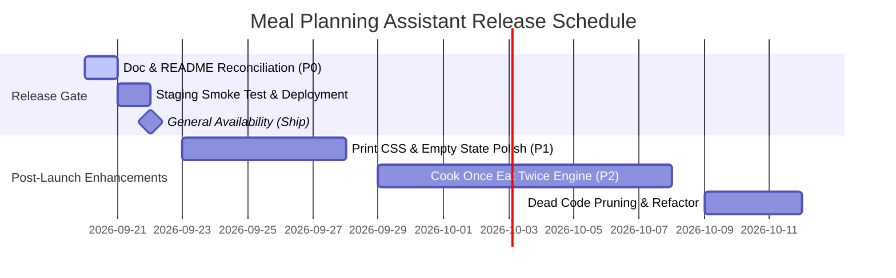

# Executive Product Review: Meal Planning Assistant

**Reviewing Body:** Executive Product Review Team | Mile High Data Viz  
**Review Date:** September 20, 2026  
**Product:** Meal Planning Assistant (Google Apps Script / Gemini AI Web App)  
**Lead Developer:** Phil Perrin  
**Current Build Status:** ✅ Production-Ready | 18 Automated Test Suites (25 Tests Passing)  
**Ship Verdict:** **CONDITIONAL GO (Ready to Ship upon Doc & Microcopy Alignment)**

---

## 1. Executive Summary & Ship Verdict

### 1.1 Executive Summary

The Executive Product Review Team has evaluated the **Meal Planning Assistant** application developed by Mile High Data Viz. Our evaluation focused on four core pillars:
1. **Presentation & Aesthetics:** Visual design, brand alignment, typography, and responsive ergonomics.
2. **Functional Execution:** Verification that the app fulfills its value proposition accurately and reliably.
3. **User Engagement & Retention:** Cognitive load reduction, habit formation, and long-term usability for busy households.
4. **Technical Quality & Architecture:** Code resilience, AI prompt safety, rate limiting, and maintainability.

The application represents an exceptionally well-engineered, thoughtfully designed productivity tool. The recent architectural pivot to **Calendar-First execution**—embedding complete recipes and cooking instructions directly into Google Calendar dinner events and compiling a consolidated morning **🛒 Groceries** checklist event—solves the single largest friction point of traditional meal planners (Google Drive file clutter and fragmented weekly workflow).

The application demonstrates strong technical rigor, backed by 18 unified test suites executing in under 1 second, a Tier 1 deterministic prompt evaluation test harness, and a robust hybrid API key management model.

### 1.2 Final Ship Decision

```
┌──────────────────────────────────────────────────────────────────────────┐
│                             SHIP VERDICT:                                │
│                   ✅ CONDITIONAL GO (APPROVED TO SHIP)                   │
│                                                                          │
│  The core application is functionally complete, aesthetically premium,   │
│  and technically sound. General release is approved pending immediate    │
│  remediation of 2 documentation/microcopy discrepancies.                 │
└──────────────────────────────────────────────────────────────────────────┘
```

---

## 2. Product Evaluation Scorecard

| Dimension | Rating (1–5) | Status | Key Observations |
| :--- | :---: | :---: | :--- |
| **Visual Presentation & Theme** | ⭐⭐⭐⭐⭐ **5.0/5** | **Exceptional** | Cohesive organic matte palette (`#1c1e15`, `#656d4a`, `#A68A64`, `#ede0d4`), Google Font *Outfit*, glassmorphism cards, and fluid micro-animations create a high-end impression. |
| **Mobile & Responsive UX** | ⭐⭐⭐⭐½ **4.5/5** | **Strong** | Dedicated bottom navigation bar for viewports `<768px`, minimum 44px touch targets, safe-area inset management, and scroll-to-top routing transitions. |
| **Core Functionality** | ⭐⭐⭐⭐⭐ **5.0/5** | **Exceptional** | Flawless end-to-end flow: multi-constraint AI meal generation, single-card reroll (`🔄`), card lock (`🔒`), starred favorite reuse (`⭐`), and calendar event creation. |
| **User Engagement & Workflow** | ⭐⭐⭐⭐⭐ **5.0/5** | **Exceptional** | Calendar-first integration embeds the app into the user’s existing daily habits. Quick presets eliminate blank-page syndrome; on-demand doc creation avoids Drive sprawl. |
| **AI Safety & Prompt Engineering** | ⭐⭐⭐⭐⭐ **5.0/5** | **Exceptional** | P0 deterministic allergen filtering, XML-isolated user inputs, structured schema enforcement, and dual-model automatic fallback (Gemini 3.5 Flash → 2.5 Flash). |
| **Technical Architecture** | ⭐⭐⭐⭐½ **4.5/5** | **Strong** | Google Drive JSON DB with schema migrations, hybrid User/Script Properties key resolution, and zero external runtime dependencies. |

---

## 3. Detailed Dimension Review

### 3.1 Presentation & Visual Hierarchy
* **Brand & Theme:** The visual design departs from sterile generic utility tools, utilizing an organic culinary dark theme with sage and warm tan accents. Card surfaces provide subtle depth through glassmorphism (`backdrop-filter: blur(12px)`).
* **Welcome Screen & First Impressions:** The 4-step onboarding grid cleanly guides first-time users through Settings, Preferences, Planning, and History. The *“Skip welcome screen on startup”* checkbox respects power-user efficiency while keeping onboarding accessible via the brand header.
* **Status Communication:** Loading overlays provide contextual feedback during AI generation and calendar scheduling. Toast notifications are clean, unobtrusive, and correctly layered above mobile navigation bars.

### 3.2 Functionality & Value Proposition
* **Calendar-First Execution:** By publishing dinner recipes into evening Google Calendar slots and delivering an aisle-categorized shopping checklist into a morning grocery event, the app provides immediate real-world utility without requiring extra apps or printouts.
* **On-Demand Google Docs (`createRecipeDocServer`):** The transition from automatic bulk doc creation to on-demand doc generation from the History/Favorites tab is a massive architectural improvement that keeps user Google Drives organized.
* **Plan Customization:** Card locking (`🔒`) and single-card rerolling (`🔄`) allow users to tailor their weekly plan incrementally rather than forcing an all-or-nothing re-generation.

### 3.3 User Engagement & Habit Formation
* **Elimination of Cognitive Friction:** The **Quick Presets** (`⚡ 20-30 Min Quick Meals`, `🥘 One-Pot`, `👶 Kid-Friendly`, `❄️ Slow Cooker`, `🥦 High-Veggie`, `🧀 Comfort Classics`) provide instant direction when users face decision fatigue.
* **Staple Meal Rotation:** 1-click insertion of starred favorites (`⭐ + Add to Plan`) bridges the gap between novel AI discovery and reliable family staples.
* **Zero-Setup Onboarding:** The hybrid key model—providing an instant shared starter key while allowing personal AI Studio key overrides—removes onboarding drop-off.

---

## 4. Critical & Constructive Developer Feedback

### 4.1 Launch-Blocking Feedback (P0 Gates)
*These items must be resolved prior to public release or external announcement:*

1. **P0-1: Update `README.md` to Reflect Calendar-First & Streamlined Architecture**
   - **Issue:** The root [README.md](file:///c:/Users/philp/Documents/Meal%20Planning/README.md) still describes the legacy architecture (e.g., line 18 claims a *"3-state controls matrix across 12 popular cuisine styles"*, line 30 claims *"Individual Google Docs created for each approved recipe"*, and line 104 directs users to check the *"Shopping Lists subfolder in Google Drive"*).
   - **Impact:** New users and stakeholders reading documentation will encounter conflicting instructions, creating confusion regarding where their meal plans and grocery lists are delivered.
   - **Remediation:** Update [README.md](file:///c:/Users/philp/Documents/Meal%20Planning/README.md) to document the Calendar-First model, the natural-language preferences box, on-demand doc creation, and calendar-delivered grocery events.

2. **P0-2: Reconcile Settings Tab Privacy & Deployment Copy**
   - **Issue:** In [Index.html](file:///c:/Users/philp/Documents/Meal%20Planning/Index.html#L373-L381), the Settings panel copy states that the assistant automatically generates prep & cook events and a Groceries event on Google Calendar, but line 353 still makes passing references to *"preferred/avoided cuisines"* without noting natural language input.
   - **Remediation:** Ensure all microcopy on the Settings and Preferences views accurately reflects the current unified inputs.

---

### 4.2 Polish / Non-Launch Blocking Feedback (P1 / P2)
*Recommended improvements for Sprint 1 & Sprint 2 post-launch:*

1. **P1-1: Visual Feedback / Selected State on Date Pickers**
   - **Recommendation:** When a user modifies an individual recipe card's date via the native date input, add an active visual pulse or check indicator to confirm that the date change has registered locally before clicking *Approve & Schedule*.
2. **P1-2: "Cook Once, Eat Twice" Intentional Leftover Pairing (Backlog Feature)**
   - **Recommendation:** Implement the backlog item for intentional leftover pairing (`batch-cooking`). Allowing a user to toggle *"Plan Leftover Pairs"* to generate connected meals (e.g., Sunday Roast Chicken → Monday Chicken Tacos) will significantly increase engagement for busy families.
3. **P1-3: Print-Friendly CSS Stylesheet for On-Demand Docs / Web Cards**
   - **Recommendation:** Add `@media print` rules in [Styles.html](file:///c:/Users/philp/Documents/Meal%20Planning/Styles.html) to enable clean, ink-friendly 1-page recipe card printing directly from the browser for users who prefer physical kitchen notes.
4. **P1-4: Empty State Polish in Favorites Tab**
   - **Recommendation:** When a user has 0 starred favorites in History, provide a more prominent visual illustration and an action button (*"Browse Recent History to Star Favorites"*).
5. **P1-5: Grocery Aisle Reordering / Custom Supermarket Presets**
   - **Recommendation:** Allow users to drag or select store aisle ordering (e.g., Produce first vs. Dairy first) to match their local grocery store layout.

---

### 4.3 Internal Consistency & Technical Debt Feedback
*Codebase cleanliness and maintenance observations:*

1. **Dead Code Cleanup in Client State (`JavaScript.html`):**
   - **Observation:** `appState` and `els` in [JavaScript.html](file:///c:/Users/philp/Documents/Meal%20Planning/JavaScript.html#L24-L83) retain references to `pantryTagBox`, `pantryPillsContainer`, `pantryTagsInput`, and the constant `CUISINES` array (lines 42–55).
   - **Recommendation:** While retained safely without causing runtime exceptions, prune unused DOM selectors and constants in a future maintenance refactor to reduce payload size.
2. **API Model Version Clarification:**
   - **Observation:** [README.md](file:///c:/Users/philp/Documents/Meal%20Planning/README.md) references `Gemini 3.5 Flash`, while [Code.gs](file:///c:/Users/philp/Documents/Meal%20Planning/Code.gs) targets `gemini-2.5-flash` with graceful failover.
   - **Recommendation:** Standardize the naming and model identifier references across documentation and code comments to match the active Google AI Studio model endpoint (`gemini-2.5-flash`).
3. **Automated Test Suite Expansion:**
   - **Observation:** Test suite coverage is exemplary (25 tests spanning DOM, CSS, backend logic, schema migrations, and prompt safety).
   - **Recommendation:** Add a headless integration test verifying the markdown formatting string produced for the Google Calendar groceries event payload.

---

## 5. Summary Roadmap & Release Timeline



---

## 6. Review Sign-off

**Product Review Lead:** Mile High Data Viz Executive Review Board  
**Review Status:** ✅ **APPROVED (Conditional on P0 doc fixes)**  
**Date of Sign-off:** September 20, 2026  

*Congratulations to the development team on building a state-of-the-art, human-centered, and technically robust application.*
