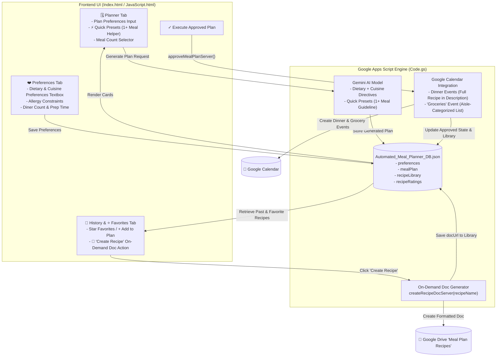
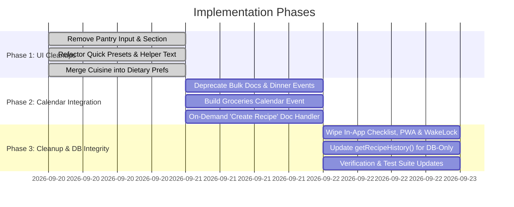

# Specification: Calendar-First Architecture, UI Streamlining & On-Demand Recipe Doc Creation

**Author**: Antigravity Assistant  
**Date**: September 19, 2026  
**Status**: Ready for Implementation  
**Scope**: Frontend UI Simplification, Google Calendar-First Integration, PWA/Offline Cleanup, On-Demand "Create Recipe" Doc Generation, and Database/History Continuity  

---

## 1. Executive Summary & Vision

This specification details a strategic pivot to a **lean, Calendar-First architecture** for the Automated Meal Planning Assistant. 

By centering the workflow on **Google Calendar** as the single source of truth for both cooking execution (dinner events with embedded recipes) and grocery shopping (a dedicated "Groceries" event with sectioned shopping lists), we eliminate unnecessary friction, avoid cluttering Google Drive with throwaway Google Docs, and strip out complex in-app mobile shopping checklists and PWA offline synchronizers.

For users who still desire a permanent, printable, or shareable document for specific dishes, we introduce an **On-Demand "Create Recipe" Google Doc button** on the **History** and **Favorites** tabs.

### Key Objectives:
1. **Planning Tab Streamlining**:
   - Remove the "Use up ingredients on hand" section from the frontend interface.
   - Rename "Quick Mood & Style Presets" to **"Quick Presets"** and add helper text explaining that presets will be applied to at least one meal in the plan (not universally across all meals).
2. **Preferences Tab Consolidation**:
   - Merge "Cuisine & Meal Style Preferences" directly into the "Dietary Preferences" freeform dialogue.
   - Remove the 12-button 3-state cuisine grid from the UI and update guidance helper text.
   - Update the backend Gemini prompt to read cuisine and style directives from Dietary Preferences.
3. **Google Calendar-First Export (Deprecate Bulk Google Docs Generation)**:
   - Schedule each dinner event on Google Calendar containing:
     - **Title**: Recipe Name
     - **Description**: Recipe Description, Diners Scaled, Prep/Cook Times, Complete Ingredients list, and Step-by-Step Cooking Instructions.
   - Create a single **"Groceries" Calendar Event** containing the complete consolidated grocery shopping list organized by supermarket aisle/category.
   - Cease generating bulk Google Docs during weekly plan approval.
4. **On-Demand "Create Recipe" Doc Generation (History & Favorites Tab)**:
   - Transform the previous static "Open Recipe" link into an interactive **"Create Recipe"** (or **"Open Doc"** if already created) action.
   - Users can generate a clean Google Doc on demand directly from the database structured library without bloating Drive with unneeded files.
5. **Clean Removal of In-App Shopping Checklist & PWA/Offline Features**:
   - Wipe out the fullscreen Grocery Shopping Mode modal, Wake Lock API, aisle filter pills, and offline status pill/sync queue.
6. **Architectural Safety & History Continuity**:
   - Retain all meal plan and recipe records in `Automated_Meal_Planner_DB.json`.
   - Update `getRecipeHistory()` to source recipe history and favorites directly from `db.recipeLibrary` rather than scanning Google Drive Docs.

---

## 2. Architecture & Data Flow



---

## 3. Detailed Component Specifications

### 3.1 Planning Tab Updates

#### 1. Remove "Use up ingredients on hand" Section
- **UI Action**: Remove the `.pantry-input-section` DOM container (lines 153–174 in `Index.html`), including:
  - Input field (`#pantry-tags-input`)
  - Tag box / pill container (`#pantry-tag-box`, `#pantry-pills-container`)
  - Quick-add suggestion chips (`#pantry-quick-suggestions`)
  - Clear button (`#btn-clear-pantry`)
- **JavaScript & Backend Decoupling**:
  - In `JavaScript.html`, omit pantry ingredient extraction from `handleGenerateMealPlan()` (pass empty array `[]` or `null`).
  - In `Code.gs`, leave helper functions (`buildPantryDirectiveText`) intact for backward compatibility, but ensure `generateMealPlanServer()` and `rerollSingleRecipeServer()` operate smoothly without required pantry arguments.

#### 2. Refactor "Quick Presets"
- **Rename Section**: Change label from `⚡ Quick Mood & Style Presets:` to `⚡ Quick Presets`.
- **Add Helper Text**: Add an intuitive description immediately below the label:
  > *"Select one or more presets. At least one meal in your plan will incorporate these styles (presets do not apply to every meal)."*
- **Gemini Prompt Directive Update**:
  - Update `buildTagDirectivesText(selectedTags)` in `Code.gs` to explicitly instruct Gemini:
    ```text
    - Preset Style Guidelines: The user has selected the following quick preset styles: [selectedTags]. Ensure at least one or more recipes in the meal plan distinctly incorporate these characteristics (e.g. 20-30 min quick prep, one-pot cleanup, kid-friendly, etc.) without forcing all recipes to conform to every preset.
    ```

---

### 3.2 Preferences Tab Updates

#### 1. Merge Cuisine Preferences into Dietary Preferences Textbox
- **UI Action**:
  - Remove the separate "Cuisine & Meal Style Preferences" group (lines 292–310 in `Index.html`), including the `#cuisine-grid` container and "↺ Reset All" button.
  - Update the "Dietary Preferences" label and helper description in `Index.html`:
    - **Label**: `Dietary & Cuisine Preferences`
    - **Helper Text**: `Specify dietary choices, preferred cuisines (e.g., Italian, Mexican, Mediterranean, Asian-inspired), dietary styles, or specific dislikes.`
    - **Textarea Placeholder**: `e.g., Prefer Mediterranean and Mexican cuisines. High protein, lean meats, plenty of vegetables. Avoid heavy creams.`
- **Client State Handling**:
  - In `JavaScript.html`, remove `renderCuisineGrid()` invocation and `appState.cuisinePreferences` DOM mapping from `loadPreferencesToForm()` and `handleSavePreferences()`.
  - Ensure `appState.db.preferences.dietaryPreferences` captures the full user input.

#### 2. Backend Prompt Alignment
- In `Code.gs`, update `generateMealPlanServer()` and `rerollSingleRecipeServer()`:
  - Update the system instructions passed to Gemini to inform the model that all dietary, lifestyle, and cuisine preferences are provided in the `Dietary & Cuisine Preferences` field:
    ```text
    - Dietary & Cuisine Preferences: {prefs.dietaryPreferences || "None specified"}
    (Incorporate any mentioned cuisine types, flavor profiles, and dietary preferences specified above).
    ```
  - Gracefully ignore or maintain existing legacy `cuisinePreferences` object keys without throwing errors.

---

### 3.3 Google Calendar Integration (Calendar-First Architecture)

#### 1. Deprecate Bulk Google Docs Generation
- In `Code.gs` (`approveMealPlanServer`):
  - **Remove** automated calls to `DocumentApp.create()` for all recipes during weekly plan execution.
  - **Remove** automated calls to `DocumentApp.create()` for the shopping list document.
  - Maintain the structured recipe library update in `db.recipeLibrary` and execution metadata in `db.mealPlan.executionResult`.

#### 2. Dinner Events on Google Calendar
- For each approved recipe in the meal plan:
  - **Event Title**: `Meal Prep: ${recipe.name}` (or `${recipe.name}`)
  - **Start Time / End Time**: Scheduled on the assigned date at `prefs.defaultMealTime` (duration: 1 hour).
  - **Event Location**: `Home Kitchen`
  - **Event Description Format**:
    ```text
    🍽️ Recipe: [Recipe Name]
    📖 Description: [Recipe Description]

    👥 Diners: [dinersCount]
    ⏱️ Prep Time: [prepTime] | Cook Time: [cookTime]

    🛒 Ingredients:
    • [amount] [unit] [ingredient name]
    • ...

    👩‍🍳 Step-by-Step Instructions:
    1. [Step 1]
    2. [Step 2]
    ...
    ```

#### 3. Consolidated "Groceries" Calendar Event
- For the full meal plan, generate a single dedicated grocery shopping event on Google Calendar:
  - **Target Date**: Earliest scheduled meal date (or current date if not specified).
  - **Time**: Scheduled in the morning (e.g., 09:00 AM – 10:00 AM) or configured meal prep time on the first day.
  - **Event Title**: `🛒 Groceries`
  - **Event Location**: `Supermarket / Grocery Store`
  - **Event Description Format**:
    ```text
    🛒 Weekly Meal Plan Grocery Shopping List
    📅 Plan Starting: [Earliest Date]
    👥 Scaled for: [dinersCount] Diners
    🍽️ Planned Meals: [Meal 1], [Meal 2], [Meal 3]...

    ━━━━━━━━━━━━━━━━━━━━━━━━━━━━━
    ITEMS BY STORE SECTION
    ━━━━━━━━━━━━━━━━━━━━━━━━━━━━━

    🥬 Produce
    • 2 heads Broccoli
    • 1 bag Baby Spinach
    • 3 whole Bell peppers

    🥩 Meat & Seafood
    • 1.5 lbs Chicken breasts
    • 1 lb Ground turkey

    🧀 Dairy & Refrigerated
    • 8 oz Shredded mozzarella
    • 1 cup Greek yogurt

    🥫 Pantry & Canned
    • 1 can (15 oz) Diced tomatoes
    • 1 box Orzo pasta

    🧂 Spices & Baking
    • 1 tsp Smoked paprika
    • 2 tbsp Olive oil
    ```

#### 4. Approval Screen & Success UI Updates
- In `JavaScript.html` (`renderMealPlan`):
  - When a plan is executed and approved, replace the links section:
    - Remove the `🛒 In-App Grocery Checklist` anchor button.
    - Remove Google Drive Document links (`res.shoppingListDocUrl`, `res.recipeDocs`).
    - Present a single, prominent action: **📅 Open Google Calendar** (`https://calendar.google.com`).
    - Update success description copy:
      > *"Your meal plan has been scheduled! Individual recipe instructions and your categorized grocery shopping list have been added directly to your Google Calendar."*

---

### 3.4 On-Demand "Create Recipe" Google Doc Generation (History Tab)

#### 1. UI Behavior in `renderHistoryList`
In `JavaScript.html`, update the action buttons rendered for each recipe row:
- If `item.docUrl` exists:
  ```html
  <a href="${escapeHtml(item.docUrl)}" target="_blank" class="doc-link" title="Open Google Doc">
    📄 Open Doc
  </a>
  ```
- If `item.docUrl` is not present:
  ```html
  <button type="button" class="btn-create-doc" 
    onclick="handleCreateRecipeDoc(event, '${escapeJSString(item.name)}')" 
    title="Generate a Google Doc for this recipe">
    <span>📄 Create Recipe</span>
  </button>
  ```

#### 2. Client-Side Handler (`handleCreateRecipeDoc`)
```javascript
function handleCreateRecipeDoc(event, recipeName) {
  event.stopPropagation();
  const btn = event.currentTarget;
  const originalHtml = btn.innerHTML;
  btn.disabled = true;
  btn.innerHTML = `<span class="loading-spinner-inline"></span> Creating...`;
  
  showToast(`Creating Google Doc for "${recipeName}"...`);
  
  google.script.run
    .withSuccessHandler(function(res) {
      if (res && res.success && res.docUrl) {
        showToast(`✓ Google Doc created for "${recipeName}"!`);
        // Update local state cache
        if (appState.historyData && appState.historyData.library && appState.historyData.library[recipeName]) {
          appState.historyData.library[recipeName].docUrl = res.docUrl;
          appState.historyData.library[recipeName].docId = res.docId;
        }
        // Open newly created doc in new window
        window.open(res.docUrl, '_blank');
        // Re-render history list to show "Open Doc" link
        renderHistoryList();
      } else {
        btn.disabled = false;
        btn.innerHTML = originalHtml;
        showToast("Error creating recipe document.", true);
      }
    })
    .withFailureHandler(function(err) {
      btn.disabled = false;
      btn.innerHTML = originalHtml;
      showToast("Error creating document: " + err.message, true);
    })
    .createRecipeDocServer(recipeName);
}
```

#### 3. Backend Implementation in `Code.gs` (`createRecipeDocServer`)
```javascript
/**
 * Creates a standalone Google Doc for a recipe on-demand from db.recipeLibrary.
 * Saves document into "Meal Plan Recipes" folder and caches docUrl in database.
 */
function createRecipeDocServer(recipeName) {
  try {
    recipeName = String(recipeName || "").trim();
    if (!recipeName) throw new Error("Recipe name is required.");
    
    var file = getDatabaseFile();
    var db = JSON.parse(file.getBlob().getDataAsString());
    var library = db.recipeLibrary || {};
    var recipe = library[recipeName];
    
    if (!recipe) {
      throw new Error("Recipe '" + recipeName + "' not found in recipe library.");
    }
    
    // Return existing URL if already created and valid
    if (recipe.docUrl && recipe.docId) {
      try {
        var existingFile = DriveApp.getFileById(recipe.docId);
        if (existingFile && !existingFile.isTrashed()) {
          return { success: true, docUrl: recipe.docUrl, docId: recipe.docId };
        }
      } catch (e) {
        // Doc might have been deleted, proceed with recreating
      }
    }
    
    var parentFolder = getOrCreateFolder(PARENT_FOLDER_NAME);
    var datePrefix = recipe.lastScheduledDate ? recipe.lastScheduledDate.replace(/-/g, '') : new Date().toISOString().substring(0, 10).replace(/-/g, '');
    var docName = datePrefix + " - " + recipe.name;
    
    var doc = DocumentApp.create(docName);
    var body = doc.getBody();
    
    body.appendParagraph(recipe.name).setHeading(DocumentApp.ParagraphHeading.HEADING1);
    if (recipe.description) {
      body.appendParagraph(recipe.description).setItalic(true);
    }
    body.appendParagraph("Prep Time: " + (recipe.prepTime || "15m") + " | Cook Time: " + (recipe.cookTime || "20m"));
    body.appendParagraph("Diners Scaled For: " + (recipe.originalDiners || db.preferences.dinersCount || 2)).setBold(true);
    
    body.appendParagraph("Ingredients").setHeading(DocumentApp.ParagraphHeading.HEADING2);
    (recipe.ingredients || []).forEach(function(ing) {
      body.appendListItem(ing.amount + " " + ing.unit + " " + ing.name);
    });
    
    body.appendParagraph("Instructions").setHeading(DocumentApp.ParagraphHeading.HEADING2);
    (recipe.instructions || []).forEach(function(step, stepIdx) {
      body.appendListItem((stepIdx + 1) + ". " + step);
    });
    
    doc.saveAndClose();
    
    var docFile = DriveApp.getFileById(doc.getId());
    docFile.moveTo(parentFolder);
    
    var docUrl = doc.getUrl();
    var docId = doc.getId();
    
    // Cache back to library
    recipe.docUrl = docUrl;
    recipe.docId = docId;
    db.recipeLibrary[recipeName] = recipe;
    db.lastUpdated = new Date().toISOString();
    file.setContent(JSON.stringify(db, null, 2));
    
    return { success: true, docUrl: docUrl, docId: docId };
  } catch (e) {
    Logger.log("Error creating recipe doc on demand: " + e.toString());
    throw new Error("Failed to create recipe document: " + e.message);
  }
}
```

---

### 3.5 Removal of In-App Shopping Checklist & PWA / Offline Features

To keep the application lean and eliminate dead code, remove the following components and dependencies:

| Feature / Component | Files Affected | Removal Details |
| :--- | :--- | :--- |
| **PWA Manifest & Meta Tags** | `Index.html` | Remove `<link rel="manifest">`, `<meta name="apple-mobile-web-app-capable">`, `<meta name="theme-color">` from `<head>`. |
| **Network Status Pill** | `Index.html`, `JavaScript.html`, `Styles.html` | Remove `#network-status-pill` from header. Remove online/offline event listeners (`window.addEventListener('online')`). |
| **Grocery Shopping Mode Modal** | `Index.html` | Remove `#grocery-mode-modal` DOM tree (lines 423–484). |
| **In-App Shopping Section in Planner** | `JavaScript.html` | Remove `renderShoppingListHtml()` call and DOM container injection. |
| **Offline Sync & Wake Lock JS** | `JavaScript.html` | Remove `ScreenWakeLock` controller, `syncShoppingChecklistServer()` calls, local `offlineSyncQueue`, and shopping checkbox state sync handlers. |
| **Backend Checklist Sync Endpoint** | `Code.gs` | Remove `syncShoppingChecklistServer()` or retain as a no-op handler. |

---

### 3.6 Database & History Tab Compatibility

#### Database Integrity (`Automated_Meal_Planner_DB.json`)
The database file in Google Drive continues to store:
- `preferences`: User settings (allergies, dietaryPreferences, dinersCount, defaultMealTime, skipWelcomePage).
- `mealPlan`: Current active plan (recipes, approved status, generatedAt, lockedIndices).
- `recipeLibrary`: Key-value cache of structured recipe objects (`{ name, description, prepTime, cookTime, ingredients, instructions, docUrl, docId, lastScheduledDate }`).
- `recipeRatings`: Favorites and star ratings (`{ [recipeName]: { isFavorite: true, rating: 5 } }`).

#### Updating `getRecipeHistory()` in `Code.gs`
- **Previous behavior**: `getRecipeHistory()` read files matching `YYYYMMDD - Recipe Name` in the Google Drive folder.
- **New behavior**: Sourced directly from `db.recipeLibrary`:
  ```javascript
  function getRecipeHistory() {
    var file = getDatabaseFile();
    var db = JSON.parse(file.getBlob().getDataAsString());
    var ratingsMap = db.recipeRatings || {};
    var library = db.recipeLibrary || {};
    
    var allRecipes = [];
    for (var recipeName in library) {
      var item = library[recipeName];
      var ratingInfo = ratingsMap[recipeName];
      var isFav = (ratingInfo && (ratingInfo.isFavorite === true || ratingInfo.rating > 0)) ? true : false;
      var recipeRating = isFav ? 5 : (ratingInfo && typeof ratingInfo.rating === 'number' ? ratingInfo.rating : 0);
      
      allRecipes.push({
        name: item.name,
        date: item.lastScheduledDate || "Previously Planned",
        description: item.description || "",
        prepTime: item.prepTime || "",
        cookTime: item.cookTime || "",
        url: item.docUrl || "",
        docUrl: item.docUrl || "",
        fileId: item.docId || "",
        isFavorite: isFav,
        rating: recipeRating,
        scheduledTime: item.lastScheduledDate ? new Date(item.lastScheduledDate).getTime() : 0
      });
    }
    
    // Sort history (most recent first) and favorites (highest rated / favorites first)
    var historyList = allRecipes.slice().sort(function(a, b) { return b.scheduledTime - a.scheduledTime; });
    var favoritesList = allRecipes.filter(function(r) { return r.isFavorite || r.rating > 0; })
                                  .sort(function(a, b) { return b.rating - a.rating; });
                                  
    return {
      history: historyList.slice(0, 50),
      favorites: favoritesList.slice(0, 50),
      ratings: ratingsMap,
      library: library
    };
  }
  ```

---

## 4. Step-by-Step Implementation Roadmap



---

## 5. Risk Assessment & Mitigations

| Risk | Impact | Mitigation |
| :--- | :--- | :--- |
| **Loss of Recipe History** | High | Previously, history read Drive Docs. We migrate `getRecipeHistory()` to pull directly from `db.recipeLibrary`, ensuring all historical and favorite meals remain accessible. |
| **On-Demand Doc Generation Latency** | Low | Inline loading indicator on the "📄 Create Recipe" button with immediate `window.open` upon creation ensures a responsive user experience. |
| **Prompt Misunderstanding for Quick Presets** | Medium | Clearly prompt Gemini that selected preset chips apply to *at least one meal*, avoiding over-constraining the entire plan. |
| **Missing Google Calendar Permissions** | Low | Calendar scopes (`https://www.googleapis.com/auth/calendar`) and Drive scopes are already active in the Apps Script project. |
