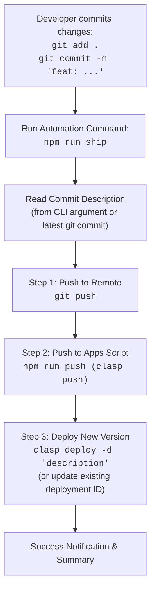

# **Technical Specification: Post-Commit Deployment Automation**

This document outlines the architecture, workflow, and implementation specification for automating the synchronization, remote repository push, and Google Apps Script deployment pipeline following local git commits.

---

## **1. Overview & Objectives**

### **1.1 Objective**
To provide a streamlined, single-command terminal workflow that automates the deployment pipeline once local changes have been staged and committed.

### **1.2 Pipeline Scope**
1. **Developer Pre-Condition:** The developer manually inspects, stages, and commits changes (`git add .` and `git commit -m "<description>"`).
2. **Automated Pipeline Execution:**
   - Push commit(s) to remote GitHub repository (`git push`).
   - Push code assets to Google Apps Script (`clasp push`).
   - Create a version and update the Google Apps Script deployment using the commit description (`clasp deploy`).

---

## **2. Workflow Architecture**



---

## **3. Detailed Functional Requirements**

### **3.1 Description Resolution Strategy**
The deployment description should be resolved using the following precedence:
1. **Explicit CLI Argument:** If provided (e.g., `npm run ship -- "custom release note"` or `node ship.js "custom note"`), use this text.
2. **Automatic Fallback:** If no argument is provided, automatically extract the latest commit message via `git log -1 --pretty=%B`.
3. **Timestamp Default:** If no git commit message can be retrieved, fall back to `Release YYYY-MM-DD HH:mm:ss`.

### **3.2 Execution Steps**

| Step | Action | Command / Mechanism | Error Handling / Behavior |
| :--- | :--- | :--- | :--- |
| **1. Verification** | Check local status | Verify working tree status | Warn if uncommitted tracked/untracked changes exist |
| **2. GitHub Sync** | Push commits to remote repo | `git push` | Abort if network fails or branch is behind remote |
| **3. Apps Script Sync** | Push code to Google Apps Script | `npx clasp push` (or `npm run push`) | Abort if file format or syntax errors are reported |
| **4. Version & Deploy** | Deploy new version in Apps Script | `npx clasp deploy [-i <DEPLOYMENT_ID>] -d "<description>"` | Abort if Google authorization or deployment limits fail |

### **3.3 Deployment Targeting Modes**

1. **Update Existing Deployment (Recommended for Web Apps):**
   - Keeps the Web App / Library URL constant across releases.
   - Uses `clasp deploy --deploymentId <DEPLOYMENT_ID> --description "<description>"`.
   - The target deployment ID can be stored in an environment variable (`CLASP_DEPLOYMENT_ID`) or a local config setting.

2. **Create New Deployment:**
   - Creates a new deployment entity in Google Apps Script.
   - Uses `clasp deploy --description "<description>"`.

---

## **4. Technical Implementation Specification**

### **4.1 Script Location & Stack**
- **File:** `ship.js` (or `scripts/ship.js`)
- **Runtime:** Node.js (standard built-in modules `child_process`, `fs`)
- **Cross-Platform Support:** Fully compatible with Windows (PowerShell/CMD) and POSIX shells (macOS/Linux/Git Bash).

### **4.2 CLI Integration (`package.json`)**
The command will be added to the npm lifecycle scripts:
```json
{
  "scripts": {
    "push": "clasp push",
    "deploy": "clasp deploy",
    "ship": "node ship.js"
  }
}
```

### **4.3 Error Handling & Logging**
- Visual color-coded console logs (Step indicators, success checkmarks, error alerts).
- If any command in the sequence fails (non-zero exit code), the pipeline immediately terminates with an actionable error message and exits with status `1`.
- Clean handling of commit messages containing quotes, apostrophes, or multiline text.

---

## **5. Verification & Acceptance Criteria**

1. **Manual Commit Test:**
   - Perform a test change, stage with `git add .`, commit with `git commit -m "test: verify deployment automation"`.
   - Run `npm run ship`.
   - Confirm remote GitHub repo receives the push.
   - Confirm Google Apps Script project receives updated files.
   - Confirm Apps Script *Manage deployments* shows a new version with the matching description.

2. **Explicit Argument Override Test:**
   - Run `npm run ship -- "Override description"`.
   - Verify Apps Script deployment uses the overridden description.
