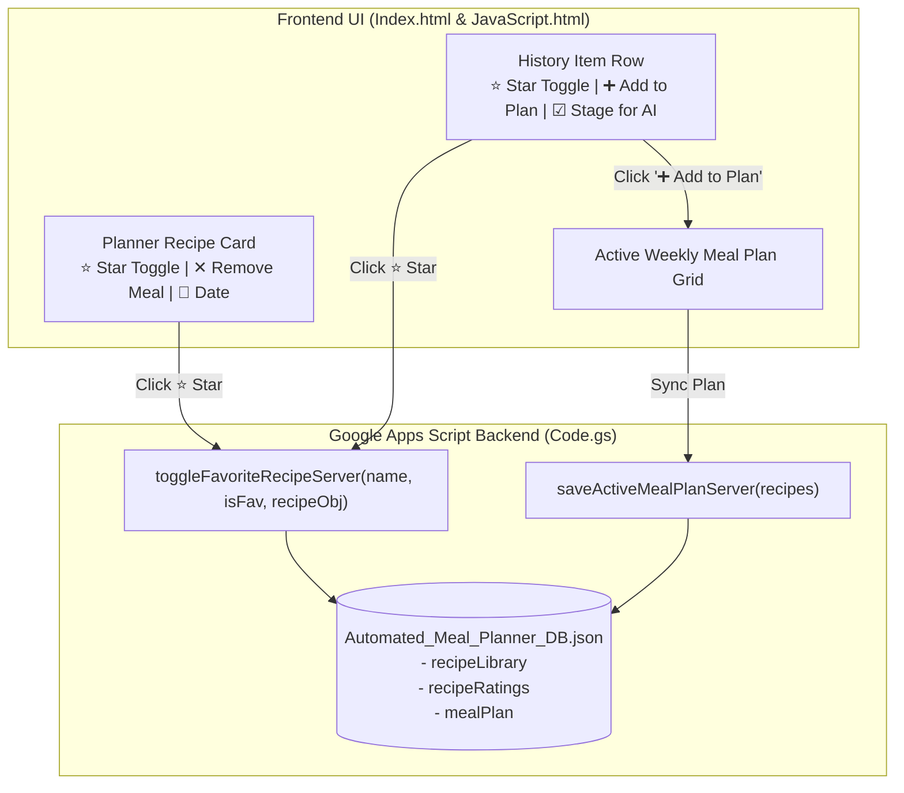

# MPA-15 Specification Sheet: Family Favorites Single-Star Bookmarking & 1-Click Insert

**Author**: Antigravity Assistant  
**Date**: September 7, 2026  
**Status**: Approved Specification  
**Target Ticket**: MPA-15 (Streamlined & Unified with MPA-8)  

---

## 1. Executive Summary & Objective

This specification establishes a **Single-Star Binary Favoriting System** and **1-Click Recipe Insertion** workflow for the Automated Meal Planning Assistant.

### User Need:
Household meal planners rely on a rotation of staple family dinners. They need to:
1. **Favorite / Bookmark Recipes with 1 Click**: Star recipes directly from the **Planner tab** (during review/cooking) or the **History tab**.
2. **1-Click Direct Insertion**: Slot any favorite recipe directly into the active weekly meal plan grid without requiring full AI re-generation.
3. **Card Removal & Customization**: Remove or swap individual recipe cards in an unapproved active meal plan.
4. **Portion & Calendar Sync**: Scale ingredients dynamically to the active diner count and include all meals in Google Calendar scheduling and Google Docs shopping lists without creating duplicate files.

---

## 2. Solution Architecture



---

## 3. Technical Specification

### 3.1 Data Model (`Automated_Meal_Planner_DB.json`)

```json
{
  "preferences": {
    "dinersCount": 4,
    "allergies": "No eggs.",
    "dietaryPreferences": "High protein."
  },
  "recipeRatings": {
    "Sheet Pan Lemon Herb Salmon": {
      "isFavorite": true,
      "rating": 5,
      "favoritedAt": "2026-09-07T20:45:00.000Z"
    }
  },
  "recipeLibrary": {
    "Sheet Pan Lemon Herb Salmon": {
      "name": "Sheet Pan Lemon Herb Salmon",
      "description": "Crisp asparagus and tender salmon roasted with garlic and lemon slices.",
      "prepTime": "15 mins",
      "cookTime": "20 mins",
      "ingredients": [
        { "name": "salmon fillets", "amount": 4, "unit": "pieces" },
        { "name": "asparagus", "amount": 2, "unit": "bunches" }
      ],
      "instructions": [ ... ],
      "originalDiners": 4,
      "docUrl": "https://docs.google.com/document/d/.../edit",
      "docId": "123",
      "dateAdded": "2026-09-07T20:45:00.000Z"
    }
  },
  "mealPlan": {
    "generatedAt": "2026-09-07T21:00:00.000Z",
    "approved": false,
    "recipes": [ ... ]
  }
}
```

### 3.2 Server-Side API Contract (`Code.gs`)

| Method | Parameters | Returns | Description |
| :--- | :--- | :--- | :--- |
| `toggleFavoriteRecipeServer(recipeName, isFavorite, recipeObj)` | `recipeName: String`, `isFavorite: Boolean`, `recipeObj?: Object` | `{ success: Boolean, isFavorite: Boolean, recipeRatings: Object }` | Sets binary favorite status in `db.recipeRatings`. If structured `recipeObj` is passed, caches it in `db.recipeLibrary`. |
| `setRecipeRating(recipeName, rating)` | `recipeName: String`, `rating: Number` | `{ success: Boolean, rating: Number, recipeRatings: Object }` | Backward-compatible rating setter. Setting rating > 0 marks `isFavorite: true`. |
| `saveActiveMealPlanServer(recipesList)` | `recipesList: Array<Recipe>` | `{ success: Boolean, db: Object }` | Persists updated active meal plan recipes array when user adds or removes meals. |
| `getRecipeHistory()` | *None* | `{ history: Array, favorites: Array, ratings: Object, library: Object }` | Returns sorted history and favorites with structured recipe definitions from library. |

---

## 4. UI/UX Interaction Details

1. **Planner Recipe Cards**:
   - Every card has a ⭐ Star/Favorite button in the header.
   - Unapproved plans display a `✕ Remove` button allowing users to delete a meal from the current plan.
2. **History Tab**:
   - Subtabs: `[ 📜 Recipe History ]` and `[ ⭐ Family Favorites ]`.
   - Each row has:
     - Re-use checkbox for batch AI generation.
     - Single-star toggle (`★` / `☆`).
     - Quick `[ ➕ Add to Plan ]` button to immediately append into the active plan.
     - `[ Open Recipe ]` Google Doc link.
3. **Diner & Portion Scaling**:
   - When a recipe is added to the active plan, if `recipe.originalDiners !== currentDiners`, ingredients are automatically scaled: $\text{amount} \times \frac{\text{currentDiners}}{\text{originalDiners}}$.

---

## 5. Acceptance Criteria

- [x] Single-star binary favoriting on active Planner cards and History rows.
- [x] Instant local optimistic UI updates with background Google Drive persistence.
- [x] `+ Add to Plan` inserts favorite recipes into active weekly meal plan with dynamic portion scaling.
- [x] Recipe removal `✕` on unapproved active meal plan cards.
- [x] Automated test suite verifying 100% pass rate.
