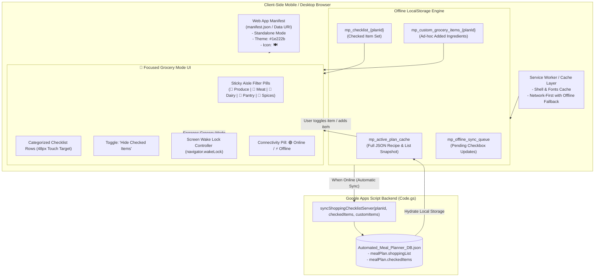

# MPA-21 Specification Sheet: Progressive Web App (PWA) & Offline Grocery Mode

**Author**: Antigravity Assistant  
**Date**: September 16, 2026  
**Status**: Pending Review & Approval  
**Target Ticket**: MPA-21 (Progressive Web App & Offline-First Grocery Shopping Experience)  
**Related Specs**: [Mobile Responsive Spec (MPA-17)](file:///c:/Users/philp/Documents/Meal%20Planning/spec/mobile_responsive_spec.md) | [In-App Grocery Checklist (MPA-13)](file:///c:/Users/philp/Documents/Meal%20Planning/test/test-suite.js)

---

## 1. Executive Summary & Problem Statement

### 1.1 Problem Statement
Busy parents frequently take their phones into supermarkets, warehouse clubs, and subterranean grocery basements (e.g., Trader Joe's, Costco, Whole Foods) where cellular coverage is weak, congested, or completely absent. 

Currently, the Meal Planning Assistant's interactive grocery checklist relies on an active session loaded from Google Apps Script. If a user refreshes the page, switches browser tabs, or opens the app inside a connectivity dead zone:
1. The web page fails to load or stalls on an HTTP timeout error.
2. Checking items off the shopping list can feel sluggish or risk data loss if the browser discards the tab from memory.
3. Phone screens frequently time out and lock every 30 seconds while pushing a shopping cart, forcing the user to repeatedly unlock their phone with wet/messy hands.

### 1.2 Objectives & Solution
This enhancement introduces **MPA-21: PWA & Offline Grocery Mode**, providing:
1. **Zero-Latency Offline-First Storage**: Complete active plan and shopping checklist snapshots cached locally in `localStorage` with versioned schema tags, making the shopping list instantly accessible with $0\text{ms}$ network dependency.
2. **PWA Manifest & Mobile Standalone Shell**: Dynamic Web App Manifest (`manifest.json`) supporting **"Add to Home Screen"** on iOS and Android with custom apple-touch-icons, matte dark theme metadata (`#1e222b`), and standalone display mode.
3. **Dedicated "🛒 Grocery Mode" Full-Screen Interface**:
   - High-contrast, distraction-free shopping view with oversized touch targets ($\ge 48\times 48\text{px}$).
   - **Aisle Jump Bar**: Sticky horizontal category pills (`[🥬 Produce]`, `[🥩 Meat]`, `[🧀 Dairy]`, etc.) to jump straight to relevant store sections.
   - **"Hide Checked Items" Toggle**: Automatically filters purchased items out of view to keep the active shopping list concise.
   - **Ad-Hoc Item Addition**: Quick "➕ Add Item" input to append spontaneous in-store purchases directly to the checklist.
4. **Screen Wake Lock Integration**: Automatically engages the browser's `navigator.wakeLock` API while Grocery Mode is active so the screen stays awake while shopping.
5. **Live Connectivity & Sync Engine**:
   - Dynamic status indicator (`🟢 Online` / `⚡ Offline Grocery Mode`).
   - Bidirectional sync reconciles item check states to the Drive database (`Automated_Meal_Planner_DB.json`) when network is restored.

---

## 2. Architecture & Data Flow



---

## 3. Detailed Technical Requirements

### 3.1 Web App Manifest & PWA Metadata (`Index.html`)
To enable full Progressive Web App behavior and "Add to Home Screen" on both iOS (Safari) and Android (Chrome):
- **Web App Manifest**: Provide a valid manifest containing:
  - `name`: "Meal Planning Assistant"
  - `short_name`: "Meal Planner"
  - `start_url`: `.` (or current Apps Script execution URL)
  - `display`: `standalone`
  - `background_color`: `#14171f`
  - `theme_color`: `#1e222b`
  - `icons`: Scalable SVG & PNG icons with `🍽️` branding.
- **iOS Meta Tags**:
  - `<meta name="apple-mobile-web-app-capable" content="yes">`
  - `<meta name="apple-mobile-web-app-status-bar-style" content="black-translucent">`
  - `<meta name="apple-mobile-web-app-title" content="Meal Planner">`
  - `<link rel="apple-touch-icon" href="...">`

### 3.2 Offline Cache & Local Storage Architecture (`JavaScript.html`)
The client must maintain a resilient offline data layer independent of network availability:

1. **Active Plan & Shopping List Snapshot**:
   - Key: `mp_active_plan_cache`
   - Content: Serialized JSON of the current meal plan, including all recipes, ingredients, and pre-computed aisle groupings.
   - Updated whenever `loadAppData()` receives a fresh plan or a new plan is generated/re-rolled.
2. **Checked Items State**:
   - Key: `mp_checklist_<planId>`
   - Content: JSON array of checked ingredient names.
   - Reads directly from `localStorage` synchronously during render.
3. **Ad-Hoc / Custom In-Store Items**:
   - Key: `mp_custom_grocery_items_<planId>`
   - Content: Array of user-added items `{ name: string, category: string, amount: string, checked: boolean }`.
4. **Offline Sync Queue**:
   - Key: `mp_offline_sync_queue`
   - When offline, changes to checklist states are queued and automatically pushed via `google.script.run.syncShoppingChecklistServer()` once `window.addEventListener('online')` triggers.

### 3.3 Focused "🛒 Grocery Mode" UI & Interaction Design
The application will provide a dedicated, full-screen **Grocery Mode** toggle directly from the shopping list panel:

1. **Trigger & Layout**:
   - Button on Shopping List Header: `🛒 Enter Grocery Mode` (with badge showing remaining items, e.g., `14 items left`).
   - In Grocery Mode, header/footer elements minimize, placing the focus 100% on the shopping list with oversized rows.
2. **Sticky Aisle Navigation Pills**:
   - Horizontal scrolling chip row pinned at the top:
     - `[All (14)]` `[🥬 Produce (5)]` `[🥩 Meat (2)]` `[🧀 Dairy (3)]` `[🥫 Pantry (3)]` `[🧂 Spices (1)]`
   - Tapping an aisle pill smooth-scrolls directly to that category header or filters the view.
3. **"Hide Checked Items" Quick Toggle**:
   - Checkbox / Switch: `👁️ Hide Checked`
   - When active, checked items collapse out of view with a subtle transition, leaving only remaining items to buy.
4. **1-Tap Quick Item Insertion**:
   - An input field at the bottom of the shopping list: `[➕ Add item (e.g., Almond milk, Paper towels)...]` with automatic category detection.
5. **Screen Wake Lock API (`navigator.wakeLock`)**:
   - On entering Grocery Mode, request a screen wake lock:
     ```javascript
     if ('wakeLock' in navigator) {
       try {
         wakeLockSentinel = await navigator.wakeLock.request('screen');
       } catch (err) {
         console.warn('Wake Lock request failed:', err);
       }
     }
     ```
   - Releases wake lock when exiting Grocery Mode or when page visibility changes.

### 3.4 Live Connection & Offline Status Banner
- Monitor `navigator.onLine` and `window.addEventListener('online' / 'offline')`.
- Render a discreet connectivity indicator in the app header:
  - **Online**: `🟢 Synced` (or hidden when idle).
  - **Offline**: `⚡ Offline Mode (Local Cache)` with tooltip *"Changes saved locally and will sync when reconnected"*.

### 3.5 Backend Synchronizer (`Code.gs`)
- Add `syncShoppingChecklistServer(planId, checkedItems, customItems)`:
  - Safely updates `Automated_Meal_Planner_DB.json` with the current checklist completion state without touching recipe formulas or generation history.
  - Returns `{ success: true, timestamp: ISOString }`.

---

## 4. UI/UX Style Guidelines & Tokens (`Styles.html`)

| Element | Specification |
|---|---|
| **Grocery Mode Overlay / View** | Background: `var(--bg-app)` (`#14171f`), full viewport height, safe-area padded. |
| **Aisle Filter Chips** | Minimum touch size: $40\text{px}$ height, pill border-radius $20\text{px}$, active state in Sage Green (`var(--accent-primary)`). |
| **Shopping Item Row (Grocery Mode)** | Minimum height: $52\text{px}$ for easy one-handed cart tapping. Checkbox hitbox: $48\times 48\text{px}$. |
| **Checked State Visuals** | Opacity: 0.45, text-decoration: line-through, checkbox background: `var(--accent-primary)`. |
| **Wake Lock Active Badge** | Subtle icon: `☀️ Screen Stays Awake` pill indicator. |
| **Offline Notification Banner** | Warm amber accent (`#e5a93c`) with high-contrast dark text. |

---

## 5. Implementation File Changes

| File | Component | Specific Modifications |
|---|---|---|
| **`Index.html`** | Header & PWA Metadata | 1. Add PWA Web Manifest link (`data:application/manifest+json;...`).<br>2. Add iOS Safari home screen meta tags & icons.<br>3. Add Grocery Mode modal/fullscreen container (`#grocery-mode-container`).<br>4. Add offline connectivity status badge (`#connection-status-pill`). |
| **`Styles.html`** | CSS Design System | 1. Add `.grocery-mode-active` full-screen container styling.<br>2. Add `.aisle-pills-bar` horizontal sticky scroll styles.<br>3. Add `.hide-checked` filter animations and compact row states.<br>4. Add `.offline-pill` & `.online-pill` badge indicators.<br>5. Add grocery mode header with item counter and exit button. |
| **`JavaScript.html`** | Client Logic & Offline Engine | 1. Implement `initOfflineStorage()` and `cacheActivePlanLocally(plan)`.<br>2. Implement `handleEnterGroceryMode()` and `handleExitGroceryMode()`.<br>3. Implement `initWakeLock()` and `releaseWakeLock()` using `navigator.wakeLock`.<br>4. Implement `initNetworkListeners()` with online/offline UI feedback.<br>5. Implement `handleAddCustomShoppingItem(name, category)`.<br>6. Implement `syncChecklistWithServer()` queue runner. |
| **`Code.gs`** | Apps Script Backend | 1. Add `syncShoppingChecklistServer(checkedItems, customItems)` endpoint.<br>2. Persist `checkedItems` array in `Automated_Meal_Planner_DB.json` under `mealPlan`. |
| **`test/test-suite.js`** | Automated Regression Suite | 1. Add Test Suite 18: "PWA Manifest, Offline Storage Caching & Grocery Mode (MPA-21)".<br>2. Validate manifest tags, offline cache keys, wake lock handler, aisle filters, and sync endpoints. |

---

## 6. Verification & Test Matrix

| # | Test Scenario | Conditions | Expected Behavior |
|:---:|---|---|---|
| 1 | **Offline Storage Snapshot** | Meal plan generated / loaded | Plan JSON and consolidated grocery items stored in `localStorage.getItem('mp_active_plan_cache')`. |
| 2 | **Offline Checklist Toggle** | Network disconnected (`navigator.onLine = false`) | Clicking checkboxes updates state immediately in `localStorage` without delay or network errors. |
| 3 | **PWA Manifest Validity** | Inspect `<link rel="manifest">` | Contains valid JSON with `standalone` display, `theme_color`, `name`, and valid icon URIs. |
| 4 | **Grocery Mode Fullscreen** | Click `🛒 Grocery Mode` | Dedicated view opens with sticky aisle pills, wake lock requested, and progress counter visible. |
| 5 | **Hide Checked Items** | Toggle `👁️ Hide Checked` | Checked items hide from list; only unpurchased items remain visible. |
| 6 | **Aisle Pill Filter** | Click `[🥬 Produce]` | List filters or scrolls directly to the Produce section. |
| 7 | **Ad-Hoc Item Addition** | Add "Paper Towels" in Pantry | Item immediately appears in Pantry section and persists in local storage. |
| 8 | **Network Reconnection Sync** | Reconnect to Wi-Fi / Cell | Sync queue pushes local changes to `syncShoppingChecklistServer` and status shows `🟢 Synced`. |
| 9 | **Screen Wake Lock** | Enter Grocery Mode on supported device | `navigator.wakeLock.request('screen')` is invoked; released on exit. |
| 10 | **Automated Suite Execution** | Run `npm test` | All 18 test suites pass with 0 failures. |
