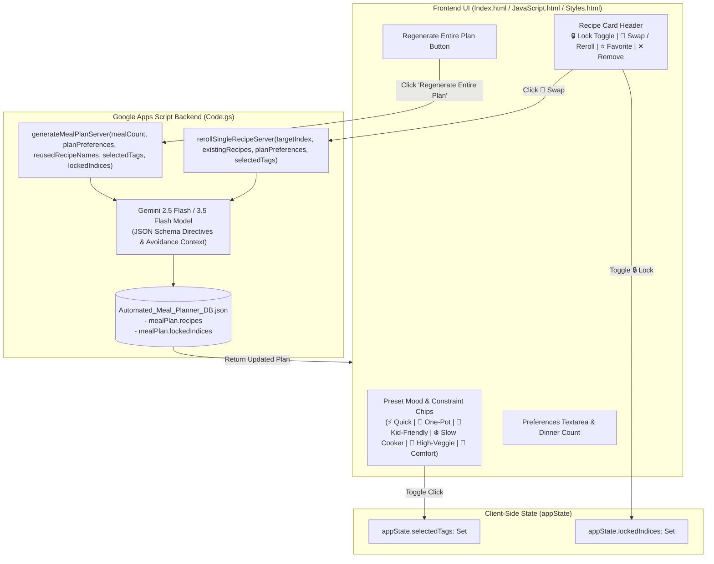

# MPA-10 & MPA-11 Specification Sheet: Single-Recipe Swap / Reroll with Card Lock & Quick-Filter Constraint Chips

**Author**: Antigravity Assistant  
**Date**: September 7, 2026  
**Status**: Pending Review & Approval  
**Target Tickets**: MPA-10 (Single-Recipe Swap / Reroll with Card Lock) & MPA-11 (Quick-Filter Mood and Constraint Chips)

---

## 1. Executive Summary & Objectives

This specification establishes two interconnected feature enhancements to the **Planner** experience in the Automated Meal Planning Assistant:

1. **MPA-10 (Single-Recipe Swap / Reroll with Card Lock)**:
   - Allow users to selectively lock recipes they love (`🔒 Lock` / `🔓 Unlock`).
   - Allow users to re-roll or swap an individual recipe (`🔄 Swap`) with dedicated card-level loading indicators.
   - When regenerating the entire plan, preserve all locked recipes and generate only enough replacement meals to satisfy the target count while strictly preventing duplicate dishes.
   - Persist lock and swap changes directly to Google Drive database (`Automated_Meal_Planner_DB.json`).

2. **MPA-11 (Quick-Filter Mood and Constraint Chips)**:
   - Provide 1-tap multi-select chips on the Planner tab to solve blank-canvas friction for parents.
   - Support standard presets:
     - `⚡ 20-30 Min Quick Meals`
     - `🥘 One-Pot / Sheet Pan (Minimal Cleanup)`
     - `👶 Kid-Friendly / Picky-Eater Safe`
     - `❄️ Slow Cooker / Instant Pot`
     - `🥦 High-Veggie / Light Dinners`
     - `🧀 Comfort Classics`
   - Combine selected preset chips seamlessly with freeform text preferences and pass structured directives to Gemini AI generation.

---

## 2. Architecture & Data Flow



---

## 3. Technical Specifications

### 3.1 Data Model Extensions (`Automated_Meal_Planner_DB.json`)

The active `mealPlan` object in the JSON database supports locked indices and tag history:

```json
{
  "preferences": {
    "allergies": "No tree nuts.",
    "dietaryPreferences": "High protein, seasonal produce.",
    "cuisinePreferences": { "Italian": "prefer", "French": "avoid" },
    "dinersCount": 4,
    "defaultMealTime": "06:00 PM",
    "skipWelcomePage": false
  },
  "mealPlan": {
    "generatedAt": "2026-09-07T21:45:00.000Z",
    "approved": false,
    "selectedTags": [
      "quick",
      "one_pot"
    ],
    "lockedIndices": [0, 2],
    "recipes": [
      {
        "name": "One-Pot Lemon Garlic Orzo with Chicken",
        "description": "Tender chicken breasts simmered with orzo, baby spinach, and fresh lemon in a single skillet.",
        "prepTime": "10 mins",
        "cookTime": "20 mins",
        "ingredients": [
          { "name": "boneless skinless chicken breasts", "amount": 1.5, "unit": "lbs" },
          { "name": "orzo pasta", "amount": 1.5, "unit": "cups" },
          { "name": "chicken broth", "amount": 3, "unit": "cups" },
          { "name": "fresh baby spinach", "amount": 3, "unit": "cups" },
          { "name": "lemon", "amount": 1, "unit": "whole" }
        ],
        "instructions": [
          "Heat olive oil in a deep skillet over medium-high heat. Season chicken with salt, pepper, and oregano, then sear until golden, about 4-5 minutes per side. Remove chicken and set aside.",
          "Add minced garlic and dry orzo to skillet, toasting for 1 minute.",
          "Pour in chicken broth and bring to a boil. Return chicken to pan, reduce heat to low, cover, and simmer for 12-14 minutes until orzo is tender.",
          "Stir in fresh baby spinach and lemon juice until spinach wilts. Serve warm."
        ],
        "isLocked": true
      },
      {
        "name": "Sheet Pan Greek Meatballs & Roasted Veggies",
        "description": "Herbed beef meatballs roasted alongside zucchini and red onion on a single baking sheet.",
        "prepTime": "15 mins",
        "cookTime": "20 mins",
        "ingredients": [ ... ],
        "instructions": [ ... ],
        "isLocked": false
      }
    ],
    "executionResult": null
  }
}
```

---

### 3.2 Backend Server-Side API (`Code.gs`)

#### 1. `rerollSingleRecipeServer(targetIndex, existingRecipes, planPreferences, selectedTags)`
- **Parameters**:
  - `targetIndex` (`Number`): The 0-based array index of the recipe card to replace.
  - `existingRecipes` (`Array<Object>`): Full array of current recipes in the active plan (used for duplicate avoidance).
  - `planPreferences` (`String`, optional): User's custom prompt text.
  - `selectedTags` (`Array<String>`, optional): Array of active chip tag keys.
- **Behavior**:
  - Validates API key and database state.
  - Compiles duplicate avoidance list using all recipe names from `existingRecipes`.
  - Maps `selectedTags` to explicit prompt directives.
  - Calls Gemini 2.5/3.5 Flash API with a schema for 1 recipe.
  - Replaces the recipe at `targetIndex` in `db.mealPlan.recipes`.
  - Preserves date schedules and lock flags across unaffected recipes.
  - Persists changes to `Automated_Meal_Planner_DB.json`.
- **Returns**: `{ success: true, newRecipe: Object, targetIndex: Number, db: Object }`.

#### 2. `generateMealPlanServer(mealCount, planPreferences, reusedRecipeNames, selectedTags, lockedIndices)`
- **Updates to Existing Method**:
  - Accepts `selectedTags` (`Array<String>`) and `lockedIndices` (`Array<Number>`).
  - Identifies which cards are currently locked vs. unlocked.
  - Preserves locked recipes in their existing positions or counts them towards the total `mealCount`.
  - Generates $N_{needed} = mealCount - (N_{reused} + N_{locked})$ new recipes.
  - Enforces duplicate avoidance for both reused and locked recipe names.
  - Integrates tag directives into Gemini's generation prompt.

---

### 3.3 Prompt Directives & Tag Mapping

The prompt builder maps preset tag identifiers to strict chef directives:

| Tag Key | Label & Icon | AI Prompt Directive |
| :--- | :--- | :--- |
| `quick` | ⚡ 20-30 Min Quick Meals | `"- Speed & Prep: Ensure all recipes require under 30 minutes of total active prep and cooking time combined."` |
| `one_pot` | 🥘 One-Pot / Sheet Pan | `"- Minimal Cleanup: Prioritize single-pot, single-skillet, or sheet-pan meals requiring minimal cookware and easy cleanup."` |
| `kid_friendly` | 👶 Kid-Friendly / Picky-Safe | `"- Family & Kids: Focus on mild, approachable, kid-approved flavor profiles with familiar textures and no overly pungent/spicy seasonings."` |
| `slow_cooker` | ❄️ Slow Cooker / Instant Pot | `"- Hands-Off Cooking: Prioritize slow-cooker (Crock-Pot), multi-cooker, or Instant Pot recipes suitable for hands-off cooking."` |
| `high_veggie` | 🥦 High-Veggie / Light | `"- Fresh & Light: Emphasize vegetable-forward, nutrient-dense, lighter dinners with vibrant seasonal produce."` |
| `comfort` | 🧀 Comfort Classics | `"- Comfort Food: Feature hearty, satisfying, warm comfort food classics (e.g. casseroles, bakes, comforting pasta dishes)."` |

---

## 4. Frontend UI/UX Design

### 4.1 Preset Constraint Chips Component (`Index.html` & `Styles.html`)

- **Location**: Rendered directly above the "Number of dinners to generate" and "Generate Dinner Plan" row.
- **Layout**: Horizontally wrapping flex container with subtle gap and responsive row wrapping.
- **Visual Styling**:
  - Default / Inactive state: Translucent matte background (`rgba(255, 255, 255, 0.05)`), border `1px solid rgba(255, 255, 255, 0.1)`, rounded pill shape (`border-radius: 20px`), subtle hover elevation.
  - Active state: Warm golden-amber accent background (`rgba(217, 119, 6, 0.2)`), border `1px solid var(--accent-primary)`, bright text, check/glow highlight.
  - Touch Target: Minimum 44px height for mobile accessibility (`min-height: 38px`, padding `8px 14px`).

### 4.2 Recipe Card Header Actions (`JavaScript.html`)

Each unapproved recipe card header contains four compact, responsive action controls:
1. **`🔒 Lock` / `🔓 Unlock` Toggle Button**:
   - Clicking toggles the locked state for that card index.
   - When locked:
     - Card receives `.recipe-card-locked` class with a subtle gold accent top-border / lock badge.
     - Swap button is disabled with tooltip: *"Unlock recipe to swap"*.
     - Remove button is disabled or warns the user.
2. **`🔄 Swap` Button**:
   - Positioned next to the lock and favorite buttons in the recipe title action group.
   - Clicking triggers `handleRerollSingleRecipe(event, idx)`:
     - Activates inline card loader overlay: `card.classList.add('rerolling')`.
     - Displays pulsing micro-spinner: `🔄 Finding replacement recipe...`.
     - Disables only the targeted card while keeping all other cards interactive.
     - Upon completion, replaces card contents with smooth fade-in animation and toast notification.
3. **`⭐ Favorite` Button**: (Maintained from MPA-15).
4. **`✕ Remove` Button**: (Maintained from MPA-15).

---

## 5. Acceptance Criteria Checklist

### MPA-10: Single-Recipe Swap / Reroll with Card Lock Support
- [ ] Each unapproved recipe card renders a `🔄 Swap` button and a `🔒 Lock` / `🔓 Unlock` toggle.
- [ ] Clicking `🔒 Lock` visually toggles the card's locked status and prevents accidental modification or removal.
- [ ] Clicking `🔄 Swap` activates a dedicated loading state exclusively on the target card.
- [ ] The backend generates a single new recipe matching dietary constraints, diner count, and active tags without duplicating any other recipe currently in the plan.
- [ ] Clicking "Regenerate Entire Plan" preserves all locked recipes and only generates replacements for unlocked slots.
- [ ] If all recipes are locked and the user attempts a full regeneration, a helpful notification explains that all cards are locked.
- [ ] Updated recipes and locked status persist cleanly to `Automated_Meal_Planner_DB.json` in Google Drive.

### MPA-11: Quick-Filter Mood and Constraint Chips
- [ ] Preset chips (`⚡ Quick`, `🥘 One-Pot`, `👶 Kid-Friendly`, `❄️ Slow Cooker`, `🥦 High-Veggie`, `🧀 Comfort`) render on the Planner tab.
- [ ] Users can toggle multiple chips simultaneously with visual active-state indicators.
- [ ] Selected chips append structured prompt directives to both full meal generation and single-recipe swap calls.
- [ ] Custom freeform text from the preferences textarea seamlessly combines with selected chips.
- [ ] Selected chips persist across tab switches in the active session.

---

## 6. Verification & Automated Testing Plan

1. **Unit & Integration Tests (`test/test-suite.js`)**:
   - **Test Suite 13 (MPA-10 Backend)**: Verify `rerollSingleRecipeServer` replaces exactly target index, avoids existing meal names in prompt, and updates DB.
   - **Test Suite 14 (MPA-10 Card Lock & Partial Regeneration)**: Verify `generateMealPlanServer` respects locked cards and only requests remaining unlocked count.
   - **Test Suite 15 (MPA-11 Constraint Chips & Directives)**: Verify `selectedTags` correctly generates system prompt directives for both single reroll and full generation.
   - **Test Suite 16 (Frontend Markup & Syntax)**: Verify chip markup, lock/swap button handlers, and DOM accessibility in `Index.html`, `JavaScript.html`, and `Styles.html`.
