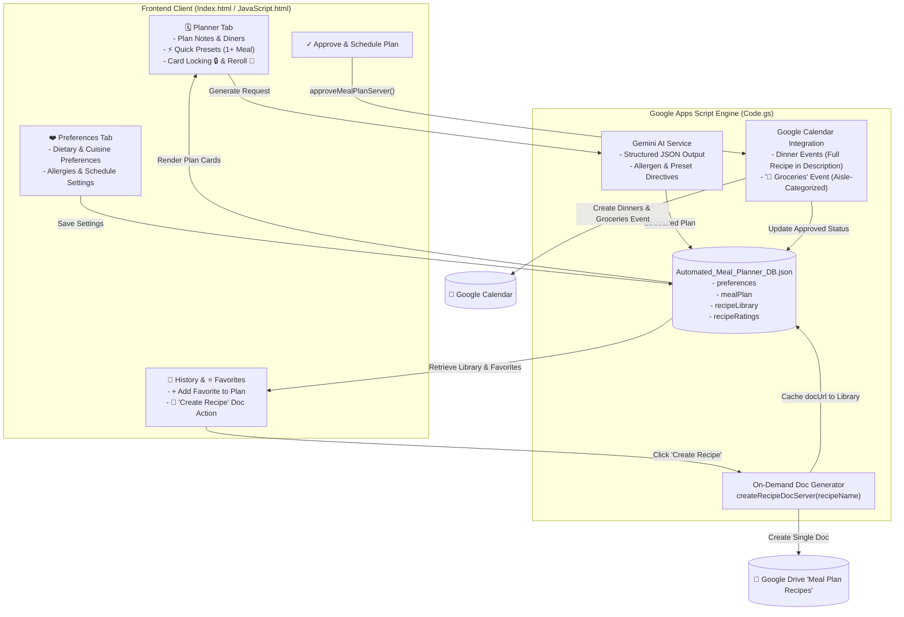

# Executive Summary: Meal Planning Application

**Date:** September 19, 2026  
**Status:** ✅ Production Deployment Live | All 18 Test Suites (24 Automated Tests) Passing  
**Key Docs:** [Calendar-First Architecture Spec](file:///c:/Users/philp/Documents/Meal%20Planning/spec/calendar_first_architecture_and_ui_streamlining_spec.md) | [Prompt Evaluation Protocol](file:///c:/Users/philp/Documents/Meal%20Planning/docs/PROMPT_EVALUATION_PROTOCOL.md) | [Backlog CSV](file:///c:/Users/philp/Documents/Meal%20Planning/jira_backlog_meal_planner_improvements.csv)

---

## 1. Summary of Delivered Epics & Milestone Commit History

The application has completed multiple high-impact development milestones, culminating in a strategic pivot to a **streamlined, Calendar-First architecture** that minimizes UI clutter and friction while centering weekly execution on Google Calendar:

| Commit | Scope / Milestone | Description |
| :--- | :--- | :--- |
| `3b60ebc` | **API Key Management** | Hybrid Personal / Shared Google Gemini API key management UI with secure storage in Apps Script ScriptProperties. |
| `ed1caa1` | **Test Infrastructure** | Established baseline Node.js headless testing harness. |
| `a094fb4` | **MPA-17 (Mobile UX)** | Mobile-first responsive redesign: sticky thumb navigation bar (`<768px`), compact cards, 44px touch targets, iOS safe-area insets. |
| `2108c24` | **Bug Fix** | Resolved notification toast queueing and message dismissal bug. |
| `9b99bf7` / `5ad16d4` / `d201f81` | **Brand & Visuals** | Dynamic SVG/canvas favicon, dismissible welcome banner, typography refinements, matte styling. |
| `29708b2` | **MPA-8 (Rating & Reuse)** | Integrated recipe bookmarking, persistent recipe library in Drive DB, and intelligent plan generation reusing family favorites. |
| `4710b83` | **Test Suite Consolidation** | Consolidated fast unified test runner (`npm test`) executing in <1s across DOM, CSS, backend logic, and schema migrations. |
| `b09bf6b` | **MPA-15 (Favorites Reconciliation)** | 1-click favorite insertion from History into the active meal plan grid with live ingredient and diner re-aggregation. |
| `f352485` | **MPA-13 (In-App Grocery List)** | Built interactive grocery checklist modal with 7 aisle categories, strike-through state, and 1-click clipboard export. |
| `70ed572` | **MPA-10 & MPA-11 (Swaps & Chips)** | Single-recipe rerolling via Gemini (`rerollSingleRecipeServer`), card locking (`🔒 Lock`), and one-tap quick preset chips (`⚡ Under 30 Mins`, `🥘 One-Pot`, `👶 Kid-Friendly`, etc.). |
| `00e87bd` | **MPA-12 (Fridge Clean Out)** | On-hand ingredients priority injection in backend prompt engine to minimize household food waste. |
| `5d73af6` | **Code Polish** | Standardized method and variable naming conventions across frontend and Apps Script backend. |
| `768cbda` | **MPA-20 (Prompt Evaluation Suite)** | Built headless Tier 1 deterministic prompt evaluation harness (`test/prompt-eval/runner.js`, allergen dictionary, scenario validation). |
| `7b31d87` | **Offline Grocery Exploration** | Implemented prototype grocery shopping mode with LocalStorage caching and Wake Lock API. |
| `a1f3d50` | **Complexity Assessment** | Conducted comprehensive scope and UI audit identifying cognitive friction points and outlining the simplification blueprint. |
| `c8e27df` | **Calendar-First Architecture & UI Streamlining** | Major architectural streamlining: switched to Calendar-First execution (dinners + sectioned Groceries event), deprecated bulk Docs generation, added on-demand recipe doc creation, merged cuisine matrix into dietary preferences, and removed PWA/offline modal bloat. |
| `4a7a77b` | **Syntax & Test Pruning** | Resolved HTML markup syntax and pruned test assertions to align with the streamlined DOM structure. |
| `5eaa60a` | **Preferences Guidance Enhancement** | Added descriptive helper guidance under the Preferences panel for natural-language dietary and cuisine inputs. |
| `43c82d5` | **Mobile UX Fix** | Managed inactive notification toast opacity and visibility to prevent overlaying the mobile sticky bottom navigation bar. |

---

## 2. Current State of the Application

* **Stability & Automated Test Suite:** The repository is 100% green with **18 automated test suites (24 tests)** executing in `<1s` via `npm test`. The suite validates DOM template integrity, responsive CSS tokens, backend API resolution, schema migration, card locks, prompt safety, and calendar-first payload generation.
* **Continuous Deployment:** Deployment automation (`npm run ship` via clasp) builds, validates regression tests, pushes code to Google Apps Script, and creates immutable versioned deployments automatically.
* **Core Application Capabilities:**
  1. **Calendar-First Weekly Scheduling:** Approving a meal plan schedules all dinner events on Google Calendar with full recipe descriptions, diner-scaled ingredients, and step-by-step cooking instructions embedded directly in the event description. Additionally, a dedicated morning **"🛒 Groceries"** calendar event is created with the entire consolidated shopping list organized by store aisle.
  2. **On-Demand "Create Recipe" Doc Generation:** Rather than cluttering Google Drive with throwaway documents on every plan approval, users can generate a formatted Google Doc on-demand for specific dishes from the **History** and **Favorites** views (`📄 Create Recipe` / `📄 Open Doc`).
  3. **Intelligent AI Generation Engine:** Generates weekly dinner plans via Google Gemini with active dietary preferences, diner counts, and non-universal quick preset directives (`⚡ Under 30 Mins`, `🥘 One-Pot`, `👶 Kid-Friendly`, `🥗 Low Carb`, `🥬 Plant-Forward`, `🍲 Comfort Food`).
  4. **Plan Customization & Reroll:** Allows swapping/rerolling individual disliked recipes (`🔄`), locking preferred recipes (`🔒`), and 1-click insertion of starred family favorites from history.
  5. **Natural-Language Preferences:** Consolidated freeform input for dietary guidelines, preferred cuisines (e.g., Italian, Mexican, Mediterranean, Asian-inspired), and lifestyle dislikes without rigid button matrices.
  6. **Persistent Recipe Library:** Structured storage in `Automated_Meal_Planner_DB.json` with schema migrations, star ratings, and resilient history retrieval sourced directly from the database.

---

## 3. Architecture & Streamlining Review (The Calendar-First Pivot)

### 3.1 Scope Evolution: From Expansion to Purpose-Built Simplicity

The application underwent a deliberate lifecycle evolution: from a basic prototype, to an expansive multi-tool platform, and finally to a refined, **Calendar-First** assistant:

```
PEAK EXPANSION (Prior State):
├── Onboarding Hero & Step Cards
├── 4 Separate Tabs (Planner, History, Preferences, Settings)
├── 3-State Cuisine Matrix (12+ Buttons)
├── Fridge Cleanout Tag Input Box + Suggestion Pills
├── 6 Quick Mood & Constraint Filter Chips
├── Fullscreen In-Store Grocery Mode Modal (Aisle Pills, Wake Lock, Hide Checked)
├── PWA Web Manifest, Network Status Pill, & Offline LocalStorage Sync
├── Bulk Automatic Google Docs Generation (1 per recipe + shopping list doc)
└── Tier 1 Deterministic Prompt Evaluation & Constraint Test Harness

CURRENT STREAMLINED CALENDAR-FIRST ARCHITECTURE:
├── Clean 4-Tab Navigation (Planner, History, Preferences, Settings)
├── Direct Freeform Natural-Language Dietary & Cuisine Preferences Box
├── Focused Quick Presets with Non-Universal Directive Helper Copy
├── Card Locking (🔒), Single-Card Reroll (🔄), and Starred Favorite Insertion (⭐)
├── Calendar-First Single Source of Truth:
│   ├── Dinner Events (Complete Recipe & Steps in Event Description)
│   └── Morning '🛒 Groceries' Event (Aisle-Categorized Shopping Checklist)
├── On-Demand '📄 Create Recipe' Google Doc Generation on History / Favorites
├── Robust Drive JSON DB (Automated_Meal_Planner_DB.json)
└── Headless Tier 1 Deterministic Prompt Safety & Evaluation Harness
```

### 3.2 Key Streamlining Changes Implemented Today

1. **Elimination of Bulk Google Docs Generation:**
   - Previously, approving a meal plan generated 6–8 Google Docs in Google Drive (one per recipe plus a shopping list doc).
   - Now, recipes and the consolidated grocery list live directly inside **Google Calendar events**, eliminating file clutter in Google Drive.
2. **On-Demand Recipe Doc Creation (`createRecipeDocServer`):**
   - Users can create a permanent Google Doc for any recipe when they actually want to print, share, or save it, directly from the History and Favorites tabs.
3. **Removal of In-App Shopping Checklist & PWA Bloat:**
   - Removed the fullscreen grocery shopping mode modal, Screen Wake Lock controller, offline sync queue, PWA manifests, and network status badge.
   - Shopping lists are delivered natively into the user's Google Calendar groceries event.
4. **Pre-Generation UI Simplification:**
   - Removed the pre-generation pantry tagger input container from the Planner tab to declutter the interface (backend prompt support remains intact).
   - Refactored "Quick Mood & Style Presets" to **"Quick Presets"** with clarifying copy explaining that presets apply to one or more meals rather than strictly forcing all meals.
5. **Cuisine Preferences Consolidation:**
   - Removed the 12-button 3-state cuisine matrix.
   - Merged cuisine preferences into the freeform **"Dietary & Cuisine Preferences"** text field with descriptive helper text.
6. **Database-Sourced Recipe History:**
   - Refactored `getRecipeHistory()` to pull directly from `db.recipeLibrary` in `Automated_Meal_Planner_DB.json` rather than querying Google Drive files.

### 3.3 Code Footprint Summary

| File | Approximate Lines | Primary Responsibilities |
| :--- | :--- | :--- |
| **[Code.gs](file:///c:/Users/philp/Documents/Meal%20Planning/Code.gs)** | ~1,373 | Calendar-First scheduling, on-demand doc creation, Drive JSON DB, Gemini AI prompt engine, recipe reuse. |
| **[Index.html](file:///c:/Users/philp/Documents/Meal%20Planning/Index.html)** | ~378 | Streamlined HTML template, 4 tab panels, quick preset chips, recipe cards, history & favorites views. |
| **[JavaScript.html](file:///c:/Users/philp/Documents/Meal%20Planning/JavaScript.html)** | ~2,347 | Tab routing, client state management, card locking/rerolling, on-demand doc handler, toast notifications. |
| **[Styles.html](file:///c:/Users/philp/Documents/Meal%20Planning/Styles.html)** | ~2,534 | Responsive layout tokens, matte dark theme, mobile bottom navigation bar, touch targets. |
| **[test/test-suite.js](file:///c:/Users/philp/Documents/Meal%20Planning/test/test-suite.js)** | ~1,217 | 18 unified test suites covering DOM, CSS, backend logic, schema migrations, prompt safety, and calendar formatting. |

---

## 4. Architecture & Data Flow



---

## 5. AI Prompt Engineering & Safety Evaluation

A formal evaluation framework ([docs/PROMPT_EVALUATION_PROTOCOL.md](file:///c:/Users/philp/Documents/Meal%20Planning/docs/PROMPT_EVALUATION_PROTOCOL.md)) validates prompt construction and constraint adherence:

### Multi-Tier Evaluation Framework
1. **Tier 1 (Deterministic Safety & Schema Rules):** Headless automated validation (`test/prompt-eval/runner.js`) executing regex-based allergen detection, JSON schema structure compliance, avoided cuisine checks, and quick prep time bounds ($\le 30$ mins for `quick` tags).
2. **Tier 2 (Semantic Evaluation):** LLM-as-a-judge scoring culinary realism, portion scaling accuracy, and ingredient synergy on a 1–5 rubric.
3. **Tier 3 (Human In-the-Loop):** Periodic spot-checks for seasonal appropriateness and preparation complexity.

### Production Prompt Engineering Safeguards
* **Native System Instructions:** Invariant persona definitions and safety constraints are isolated in Gemini's `systemInstruction` payload.
* **Defensive XML Delimiters:** Freeform user inputs are encapsulated in `<user_preferences>` tags to prevent prompt injection or formatting degradation.
* **Strict Constraint Hierarchy:** Enforced resolution order: *Allergen Safety > Dietary Preferences > Avoided Ingredients > Quick Presets > User Notes*.
* **Non-Universal Preset Directives:** Instructions explicitly direct Gemini to apply quick presets (`quick`, `one-pot`, `kid-friendly`) to *at least one or more recipes* rather than restricting the entire weekly menu.

---

## 6. Project Health & Roadmap

* **Current Status:** The application is fully stable, lean, and production-ready.
* **Delivered Today:**
  - Complete transition to Calendar-First execution.
  - Implementation of On-Demand Recipe Doc creation (`createRecipeDocServer`).
  - Streamlining of Planner and Preferences UI (pantry input removed, cuisine matrix consolidated, helper text added).
  - Removal of PWA/offline shopping modal overhead.
  - Mobile bottom navigation toast overlay resolution.
  - Full test suite alignment (18 test suites, 24 tests passing).
* **Next Steps:**
  - Monitor user feedback on calendar event grocery organization.
  - Periodic evaluation of new Gemini model releases against the Tier 1 & Tier 2 prompt benchmark suite.
